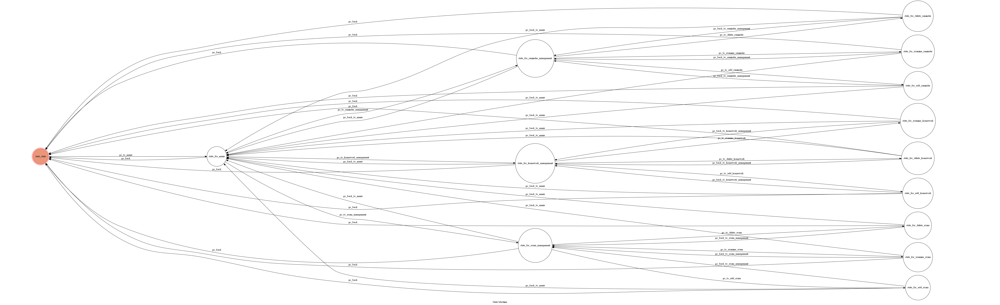

# Personal Assistant Chatbot
A Line bot based on finite state machine runs on heroku. 
Send messages to the bot for task management. 

## Setup
### Prerequisite
* Python 3.6
* Heroku(HTTPS Server)
* Line Application

## Usage
### Three functions provided
* Homework Management 
    * ___add___, ___delete___, or ___examine___ ongoing homework 

## Finite State Machine

## State Transition
The initial state is set to be `start_state`.
The messages can be sent either by typing or using the buttons.

* `start_state`: 
    * Input: Go 
    * Destination: `state_for_menu` 
    
* `state_for_menu`: 
    * Input: Homework Management 
    * Destination: `state_for_homework_management` 
    
    * Input: Exam Management 
    * Destination: `state_for_exam_management` 
    
    * Input: Reminder Management 
    * Destination: `state_for_reminder_management` 

    * Input: Reset 
    * Destination: `start_state` 
    
* `state_for_homework_management`: 
    * Input: Add 
    * Destination: `state_for_add_homework` 
    
    * Input: Examine 
    * Destination: `state_for_examine_homework` 
    
    * Input: Delete 
    * Destination: `state_for_delete_homework` 
    
    * Input: Back 
    * Destination: `state_for_menu` 
    
    * Input: Reset 
    * Destination: `start_state` 
    
* `state_for_exam_management`: 
    * Input: Add 
    * Destination: `state_for_add_exam` 
    
    * Input: Examine 
    * Destination: `state_for_examine_exam` 
    
    * Input: Delete 
    * Destination: `state_for_delete_exam` 
    
    * Input: Back 
    * Destination: `state_for_menu` 
    
    * Input: Reset 
    * Destination: `start_state` 
    
* `state_for_reminder_management`: 
    * Input: Add 
    * Destination: `state_for_add_reminder` 
    
    * Input: Examine 
    * Destination: `state_for_examine_reminder` 
    
    * Input: Delete 
    * Destination: `state_for_delete_reminder` 
    
    * Input: Back 
    * Destination: `state_for_menu` 
    
    * Input: Reset 
    * Destination: `start_state`     